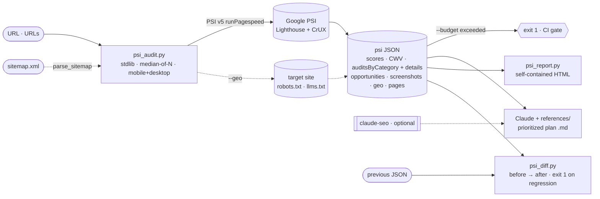

<p align="center">
  
</p>

<h1 align="center">pagespeed-plan</h1>

<p align="center">
  A zero-dependency Claude skill that turns PageSpeed Insights audits into a prioritized,
  evidence-backed, actionable improvement plan.
</p>

<p align="center">
  
  
  
  
</p>

<p align="center"><a href="README.md">Türkçe</a> · <b>English</b></p>

PageSpeed Insights gives you the score and the recommendations. `pagespeed-plan` turns them into a
CI budget gate that can fail a build, a before/after diff, a sitemap-wide crawl, a shareable report,
and a prioritized plan an agent can read and act on — all in plain Python, with no Node/Chrome and no
`pip install`.

## Contents

- [What it does](#what-it-does)
- [Install](#install)
- [Usage](#usage)
- [Modes and scripts](#modes-and-scripts)
- [How it works](#how-it-works)
- [Where it fits vs other tools](#where-it-fits-vs-other-tools)
- [Plan output](#plan-output)
- [Built-in depth](#built-in-depth)
- [Roadmap](#roadmap)
- [License and attribution](#license-and-attribution)

## What it does

It tests a URL with PageSpeed Insights v5 (Lighthouse) and extracts every visible audit —
opportunities, diagnostics, Insights, stack-specific advice, and Core Web Vitals (lab + CrUX). Each
finding carries its fix recommendation (`description`) and concrete evidence (`details`: which element,
what value → target). It won't just say *"low contrast"*; it says *"`button.cta` 2.1:1 → target 4.5:1"*.
The output is a single Markdown plan ordered by impact × effort.

Measurement uses only the Python standard library; it never modifies the site — read-only.

## Install

```bash
git clone https://github.com/tasdeleno/pagespeed-plan.git ~/.claude/skills/pagespeed-plan
```

That's it — no dependencies. (Optional: `PSI_API_KEY` env var to avoid quota limits.)

## Usage

Easiest: tell Claude **"run a PageSpeed test on this site"**. From the command line:

```bash
python3 scripts/psi_audit.py https://example.com --out psi.json          # single URL
python3 scripts/psi_audit.py --sitemap https://example.com/sitemap.xml   # whole site
python3 scripts/psi_audit.py https://example.com --budget "perf=90"      # CI gate (exit 1)
python3 scripts/psi_report.py psi.json --out report.html                 # HTML report
```

For every flag plus `psi_diff`/`contrast`, see [Modes and scripts](#modes-and-scripts).

## Modes and scripts

| Script | Job |
|---|---|
| `scripts/psi_audit.py` | Audit + JSON. Single/multi URL, `--sitemap`, `--from-robots`, `--screenshots`, `--geo`, `--budget`, `--history` |
| `scripts/psi_plan.py` | Renders the JSON into a deterministic Markdown plan, no LLM (summary/CWV/priorities/evidence) |
| `scripts/psi_diff.py` | Compares two audits (`--fail-on-regression`); `--trend history.jsonl` for a score trend over time |
| `scripts/psi_report.py` | Renders the JSON into a self-contained single-file HTML report |
| `scripts/contrast.py` | Code-side WCAG contrast ratio; exits 1 if AA fails (no browser needed) |

## How it works



`psi_audit.py` gets lab data from PSI and field data from CrUX; `--geo`/`--sitemap` are fetched directly
from the target site. The same JSON feeds `--budget` (CI gate), `psi_report.py` (HTML) and `psi_diff.py`
(comparing two runs); the plan is written by Claude + the built-in `references/` (with `claude-seo` adding depth if installed).

## Where it fits vs other tools

If you just want to look at your score, pagespeed.web.dev is enough. The difference is in what the PSI
page doesn't do:

| | pagespeed.web.dev | Lighthouse CI | Unlighthouse | pagespeed-plan |
|---|:---:|:---:|:---:|:---:|
| Prioritized plan | raw list | — | — | ✓ |
| Concrete evidence (element/value) | in UI | — | partial | text (agent-readable) |
| CI budget gate | — | ✓ | ✓ | ✓ |
| Before/after diff | — | ✓ | partial | ✓ |
| Multi-page / sitemap | — | ✓ | ✓ | ✓ |
| Single-file HTML report | own UI | server | ✓ | ✓ |
| GEO / llms.txt | — | — | — | ✓ |
| Setup cost | — | Node | Node+Chrome | zero-pip |

## Plan output

The generated Markdown covers summary scores, Core Web Vitals, impact×effort priorities, all
performance findings, SEO/accessibility actions (each with concrete evidence), stack-specific notes,
and a post-deploy retest step. Example: [`references/ornek_plan_iskeleti.md`](references/ornek_plan_iskeleti.md).

## Built-in depth

SEO/technical/accessibility depth lives locally under `references/`; `claude-seo` is not required
(if installed, it's used for optional extra depth).

| File | Content |
|---|---|
| [`core-web-vitals-derin.md`](references/core-web-vitals-derin.md) | LCP subparts, INP/CLS breakdown, thresholds, CrUX pitfalls |
| [`teknik-seo-derin.md`](references/teknik-seo-derin.md) | Crawlability, indexability, security, mobile, JS rendering, AI crawlers |
| [`seo-performans-ajan.md`](references/seo-performans-ajan.md) | Performance diagnosis method and bottleneck catalog |
| [`schema-ve-erisilebilirlik.md`](references/schema-ve-erisilebilirlik.md) | JSON-LD templates, WCAG/a11y mapping |

> Reference files are written in Turkish; the code and this README are English/Turkish.

## Roadmap

Carbon/CO₂ estimate · CrUX 25-week field trend · optional local Lighthouse (quota-free).

## License and attribution

MIT — [`LICENSE`](LICENSE). The `references/` content is derived from `claude-seo` v2.2.0
(AgriciDaniel, MIT); attribution in [`NOTICE.md`](NOTICE.md). To contribute, keep the stdlib-only
principle in the scripts and make sure `python3 scripts/test_psi_audit.py` passes.
