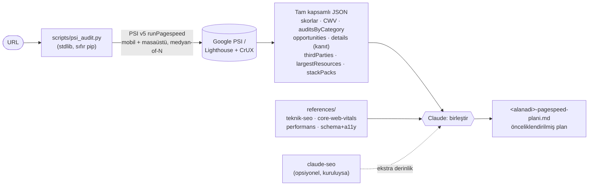

<p align="center">
  
</p>

<h1 align="center">pagespeed-plan</h1>

<p align="center">
  <b>Google PageSpeed Insights (Lighthouse) ile bir web sitesini test eder ve PSI'nin gösterdiği
  <i>tüm</i> bulgu + önerileri önceliklendirilmiş, uygulanabilir bir iyileştirme planına (Markdown) çevirir.</b>
</p>

<p align="center">
  
  
  
  
</p>

---

## Ne işe yarar?

Bir URL verirsin; bu skill:

1. Google **PageSpeed Insights v5** API'siyle (Lighthouse motoru) sayfayı mobil + masaüstü test eder,
2. PSI sayfasında görünen **her şeyi** çıkarır — fırsatlar, tanılar, yeni *Insights* denetimleri,
   teknolojiye özel öneriler, Core Web Vitals (lab + gerçek kullanıcı/CrUX),
3. Her bulgunun **önerisini** (`description`) ve **somut kanıtını** (`details`: hangi element,
   hangi değer → hedef) yakalar,
4. Hepsini etki × efor'a göre önceliklendirilmiş **tek bir Markdown planına** dönüştürür.

> **Öneri olmadan bulgu yazmaz.** "Kontrast kötü" demekle kalmaz; *"`button.cta` 2,1:1 → hedef 4,5:1"*
> gibi hangi elementin, ne kadar, hedef ne olduğunu söyler.

## Öne çıkanlar

- 🎯 **Tam kapsam** — PSI'de görünen hiçbir denetim düşmez (`TAMLIK KURALI`).
- 🧾 **Somut kanıt** — kontrast, dokunma hedefi (buton boyutu), `alt` eksikliği vb. için hangi
  element + değer.
- 📊 **Core Web Vitals** — LCP alt-parçaları, INP/CLS kırılımı, lab ↔ saha (CrUX) farkı.
- 🧩 **Yerleşik SEO/teknik/erişilebilirlik derinliği** — `references/` altında; **`claude-seo`
  gerekmez** (kuruluysa opsiyonel ekstra derinlik).
- 🪶 **Sıfır bağımlılık** — yalnızca Python 3 standart kütüphanesi; `pip install` yok.
- 🔒 **Salt-okunur** — siteyi değiştirmez, yalnızca ölçer.

## Gereksinimler

- **Python 3** (yalnızca standart kütüphane — `pip install` gerekmez).
- İnternet erişimi (`googleapis.com`).
- Opsiyonel **`PSI_API_KEY`** — anahtarsız da çalışır ama Google düşük hız limiti uygular.
  Ücretsiz anahtar: Google Cloud Console → "PageSpeed Insights API"'yi etkinleştir → Credentials → API key.

## Kurulum

Claude Code / Cowork skill dizinine kopyala:

```bash
git clone https://github.com/tasdeleno/pagespeed-plan.git ~/.claude/skills/pagespeed-plan
```

Claude içinde `pagespeed-plan` skill'i otomatik keşfedilir. Betiği bağımsız da çalıştırabilirsin.

## Kullanım

Claude'a şunlardan birini söylemen yeterli: *"şu sitenin PageSpeed testini yap"*, *"site hız denetimi"*,
*"Core Web Vitals planı hazırla"*. Skill devreye girer.

Betiği doğrudan çalıştırma:

```bash
python3 scripts/psi_audit.py https://ornek.com --strategy both --runs 3 --locale tr --out psi_veri.json

# API anahtarıyla (kota için önerilir):
PSI_API_KEY=xxxx python3 scripts/psi_audit.py https://ornek.com

# Kota (429) dolduysa:
python3 scripts/psi_audit.py https://ornek.com --runs 1
```

Betik STDOUT'a (ve `--out` ile dosyaya) tam kapsamlı bir özet JSON basar; Claude bu JSON'u
`references/` derinliğiyle birleştirip planı `<alanadi>-pagespeed-plani.md` olarak yazar.

## Nasıl çalışır?



Kısaca: **ölçüm** betikten (Python, PSI API), **derinlik** yerleşik `references/`'tan gelir;
Claude ikisini tek plana birleştirir. `claude-seo` kuruluysa üstüne ekstra derinlik ekler.

## Plan formatı (çıktı)

Üretilen Markdown planı şu bölümleri içerir:

1. **Özet** — URL, test tarihi, strateji, kategori skor tablosu (mobil vs masaüstü), bulgu sayıları.
2. **Core Web Vitals** — LCP / INP (veya TBT) / CLS için lab + saha + etiket.
3. **Öncelikli aksiyonlar** — etki × efor matrisine göre ilk 5-10 (tablo).
4. **Tüm performans bulguları** — grup grup (Fırsatlar / Tanılar / Insights) + üçüncü taraf + en ağır kaynaklar.
5. **SEO / Projeye Özel Aksiyonlar** — `references/` derinliğinden (+ claude-seo kuruluysa).
6. **Erişilebilirlik & En İyi Uygulamalar** — her bulguda somut kanıt (hangi element + değer → hedef).
7. **Teknolojiye özel notlar** — `stackPacks` özeti (WordPress, WooCommerce, React…).
8. **Sonraki adımlar / tekrar test** — değişiklik **canlıya çıktıktan sonra** aynı URL'yi yeniden test.

Örnek iskelet: [`references/ornek_plan_iskeleti.md`](references/ornek_plan_iskeleti.md).

## Yerleşik derinlik (`references/`)

`claude-seo` kurulu olmasa da plan tam yazılabilsin diye SEO/teknik/erişilebilirlik derinliği
yereldedir:

| Dosya | İçerik |
|---|---|
| [`core-web-vitals-derin.md`](references/core-web-vitals-derin.md) | LCP alt-parçaları, INP/CLS kırılımı, eşikler, CrUX parsing tuzakları |
| [`teknik-seo-derin.md`](references/teknik-seo-derin.md) | Crawlability, indexability, güvenlik başlıkları, URL, mobil, JS render — PSI audit eşlemesiyle |
| [`seo-performans-ajan.md`](references/seo-performans-ajan.md) | Performans teşhis yöntemi + darboğaz kataloğu |
| [`schema-ve-erisilebilirlik.md`](references/schema-ve-erisilebilirlik.md) | JSON-LD şablonları + WCAG/a11y denetim eşlemesi (kontrast/tap-target/alt somut yazımı) |

## Opsiyonel: claude-seo ile derinleştirme

[`claude-seo`](https://github.com/AgriciDaniel/claude-seo) eklentisi **kuruluysa**, skill URL + PSI
bulgularını bağlam vererek onu opsiyonel olarak çağırır ve çıktısını yerleşik derinliğe **ek** olarak
entegre eder. Kurulu değilse hiçbir uyarı/eksik olmaz — yerleşik referanslar yeterlidir.

## Lisans & atıf

MIT — bkz. [`LICENSE`](LICENSE). `references/` içeriği, `claude-seo` v2.2.0 (AgriciDaniel, MIT)
materyalinden türetilip PageSpeed-odaklı Türkçeye uyarlanmıştır; atıf için bkz. [`NOTICE.md`](NOTICE.md).

## Katkı

Sorun/öneri için issue açabilir, PR gönderebilirsin. Betik değişikliklerinde stdlib-only ilkesini
koru; `python3 scripts/test_psi_audit.py` öz-kontrolü geçmeli.
