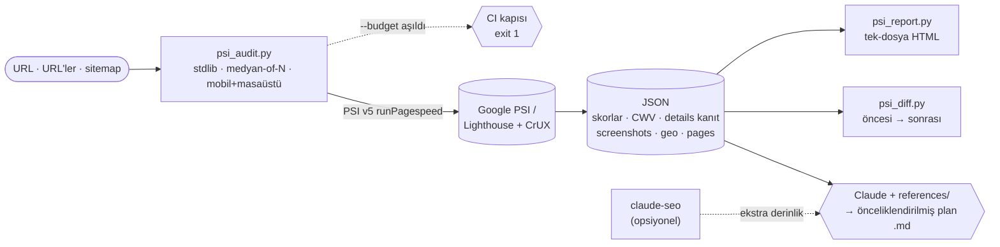

<p align="center">
  
</p>

<h1 align="center">pagespeed-plan</h1>

<p align="center">
  <b>PageSpeed Insights'ı bir <i>skora bakma aracı</i> olmaktan çıkarır;
  önceliklendirilmiş, kanıtlı ve <i>uygulanabilir</i> bir iyileştirme planına çevirir.</b><br>
  <sub>Tek URL · çoklu sayfa/sitemap · CI bütçe kapısı · öncesi/sonrası diff · paylaşılabilir HTML rapor — hepsi <b>sıfır bağımlılıkla</b>.</sub>
</p>

<p align="center">
  
  
  
  
  
  
</p>

---

## Neden bu var?

Skorunu ve önerilerini görmek için zaten [pagespeed.web.dev](https://pagespeed.web.dev) ücretsiz ve
harika. **Ama** o sana; regresyonu yakalayan bir **CI kapısı**, bir dağıtım öncesi/sonrası **diff**,
tüm siteyi tarayan **sitemap** modu, paylaşılabilir tek-dosya **rapor** ya da bir ajanın *okuyup
uygulayabileceği* **önceliklendirilmiş plan** vermez. `pagespeed-plan` tam da bu boşluğu doldurur —
ve tüm bunları **Node/Chrome kurmadan, `pip install` olmadan**, saf Python ile yapar.

> **Öneri olmadan bulgu yazmaz.** "Kontrast kötü" demekle kalmaz; *"`button.cta` 2,1:1 → hedef 4,5:1"*
> gibi **hangi elementin, ne kadar, hedefin ne** olduğunu söyler — insan da ajan da doğrudan uygular.

## Öne çıkanlar

- 🎯 **Tam kapsam + somut kanıt** — PSI'de görünen her denetim + `details` (hangi element/değer → hedef): kontrast, dokunma hedefi (buton boyutu), `alt`, `link-name`…
- 🧭 **Önceliklendirilmiş plan** — etki × efor matrisi, `TAMLIK KURALI`, ajan-eyleme dönük Markdown.
- 🚦 **CI bütçe kapısı** — `--budget` eşiği aşılınca **exit 1**; yapıyı kırmızı yap, regresyonu üretime bırakma.
- 🔀 **Öncesi/sonrası diff** — `psi_diff.py` ile skor/CWV/denetim deltaları; regresyonda exit 1.
- 🕸️ **Çoklu sayfa / sitemap** — bir URL değil, tüm siteyi tara (`--sitemap`).
- 🖼️ **Görsel** — Lighthouse filmstrip + ekran görüntüsü çıkarımı; **kendine-yeter HTML rapor**.
- 🤖 **GEO / llms.txt** — AI-crawler (GPTBot/ClaudeBot/Google-Extended…) + `llms.txt` kontrolü.
- 📊 **Core Web Vitals** — LCP alt-parçaları, INP/CLS kırılımı, lab ↔ saha (CrUX) farkı.
- 🧩 **Yerleşik derinlik** — SEO/teknik/erişilebilirlik `references/`'ta; **`claude-seo` gerekmez**.
- 🪶 **Sıfır bağımlılık** — yalnızca Python 3 stdlib. Node yok, Chrome yok, `pip install` yok.

## PSI'yi neye çevirir? (konumlama)

| İhtiyaç | pagespeed.web.dev | Lighthouse CI | Unlighthouse | **pagespeed-plan** |
|---|:---:|:---:|:---:|:---:|
| Ölçüm (Lighthouse/PSI) | ✅ | ✅ | ✅ | ✅ |
| Önceliklendirilmiş **plan** (etki×efor) | ➖ ham liste | ➖ | ➖ | ✅ |
| Somut kanıt (element/değer) | ✅ (UI) | ➖ | kısmi | ✅ (metin — **ajan okur**) |
| CI bütçe kapısı (exit-code) | ❌ | ✅ | ✅ | ✅ |
| Öncesi/sonrası **diff** | ❌ | ✅ | kısmi | ✅ |
| Çoklu sayfa / sitemap | ❌ | ✅ | ✅ | ✅ |
| Paylaşılabilir HTML rapor | ✅ (kendi UI) | sunucu | ✅ | ✅ (**tek dosya**) |
| GEO / llms.txt | ❌ | ❌ | ❌ | ✅ |
| Kurulum yükü | — | Node | Node+Chrome | **sıfır-pip** |
| Ajan **okuyup düzeltir** | ❌ | ❌ | ❌ | ✅ |

> Dürüstçe: sadece skoruna bakacaksan pagespeed.web.dev yeter. `pagespeed-plan`, PSI'yi bir **workflow +
> CI + ajan** katmanına çevirir — asıl kazanç orada.

## Kurulum

```bash
git clone https://github.com/tasdeleno/pagespeed-plan.git ~/.claude/skills/pagespeed-plan
```

Claude içinde `pagespeed-plan` skill'i otomatik keşfedilir. Betikleri bağımsız da çalıştırabilirsin.
Opsiyonel `PSI_API_KEY` (anahtarsız da çalışır, ama Google kota uygular): Google Cloud Console →
"PageSpeed Insights API" → Credentials → API key.

## Hızlı başlangıç

```bash
# 1) Tek URL — tam denetim (mobil+masaüstü, medyan-of-3)
python3 scripts/psi_audit.py https://ornek.com --strategy both --runs 3 --out psi.json

# 2) Tüm site — sitemap taraması
python3 scripts/psi_audit.py --sitemap https://ornek.com/sitemap.xml --max-pages 20 --out site.json

# 3) Görsel kanıt — filmstrip + ekran görüntüsü + GEO
python3 scripts/psi_audit.py https://ornek.com --screenshots ./sc --geo --out psi.json

# 4) CI bütçe kapısı — eşik aşılırsa exit 1
python3 scripts/psi_audit.py https://ornek.com --strategy mobile --runs 1 \
  --budget "perf=90,lcp=2500,cls=0.1,seo=90"

# 5) Öncesi/sonrası diff (regresyonda exit 1)
python3 scripts/psi_diff.py onceki.json sonraki.json --fail-on-regression

# 6) Paylaşılabilir tek-dosya HTML rapor
python3 scripts/psi_report.py psi.json --out rapor.html

# 7) Kod-tarafı WCAG kontrast (chrome gerekmez)
python3 scripts/contrast.py "#777" "#fff" --large
```

**GitHub Actions** — her PR'da performansı koru:

```yaml
- name: PageSpeed bütçe kapısı
  env: { PSI_API_KEY: ${{ secrets.PSI_API_KEY }} }
  run: |
    python3 scripts/psi_audit.py https://siten.com --strategy mobile --runs 1 \
      --budget "perf=90,lcp=2500,cls=0.1" --out psi.json
```

Claude ile: *"şu sitenin PageSpeed testini yap"* / *"Core Web Vitals planı hazırla"* demen yeterli.

## Nasıl çalışır?



**Ölçüm** betikten (PSI API), **derinlik** yerleşik `references/`'tan gelir; Claude ikisini tek plana
birleştirir. `psi_diff` / `psi_report` aynı JSON'u tüketir. `claude-seo` kuruluysa üstüne ekstra derinlik ekler.

## Plan formatı (çıktı)

1. **Özet** — URL, tarih, strateji, kategori skor tablosu, bulgu sayıları.
2. **Core Web Vitals** — LCP / INP (veya TBT) / CLS için lab + saha + etiket.
3. **Öncelikli aksiyonlar** — etki × efor, ilk 5-10.
4. **Tüm performans bulguları** — grup grup + 3. taraf + en ağır kaynaklar.
5. **SEO / Projeye Özel Aksiyonlar** — `references/` derinliğinden (+ claude-seo kuruluysa).
6. **Erişilebilirlik & En İyi Uygulamalar** — her bulguda somut kanıt (element + değer → hedef).
7. **Teknolojiye özel notlar** — `stackPacks`.
8. **Sonraki adımlar / tekrar test** — değişiklik **canlıya çıktıktan sonra** yeniden test (+ `psi_diff`).

Örnek iskelet: [`references/ornek_plan_iskeleti.md`](references/ornek_plan_iskeleti.md).

## Yerleşik derinlik (`references/`)

| Dosya | İçerik |
|---|---|
| [`core-web-vitals-derin.md`](references/core-web-vitals-derin.md) | LCP alt-parçaları, INP/CLS kırılımı, eşikler, CrUX tuzakları |
| [`teknik-seo-derin.md`](references/teknik-seo-derin.md) | Crawlability, indexability, güvenlik, mobil, JS render + AI-crawler tablosu |
| [`seo-performans-ajan.md`](references/seo-performans-ajan.md) | Performans teşhis yöntemi + darboğaz kataloğu |
| [`schema-ve-erisilebilirlik.md`](references/schema-ve-erisilebilirlik.md) | JSON-LD şablonları + WCAG/a11y eşleme (kontrast/tap-target/alt) |

## Betikler

| Betik | İş |
|---|---|
| `scripts/psi_audit.py` | Denetim + JSON (tek/çoklu URL, `--sitemap`, `--screenshots`, `--geo`, `--budget`) |
| `scripts/psi_diff.py` | İki denetimi karşılaştır (öncesi → sonrası); `--fail-on-regression` |
| `scripts/psi_report.py` | JSON → kendine-yeter tek-dosya HTML rapor |
| `scripts/contrast.py` | Kod-tarafı WCAG kontrast (chrome gerekmez); AA geçmezse exit 1 |

## Roadmap

- 🌱 Karbon / CO₂ tahmini (byte'lardan)
- 📈 CrUX 25-hafta saha trendi (iyileşiyor mu/kötüleşiyor mu)
- 🧪 Opsiyonel yerel Lighthouse (`npx lighthouse`, kota-bağımsız)

## Opsiyonel: claude-seo ile derinleştirme

[`claude-seo`](https://github.com/AgriciDaniel/claude-seo) **kuruluysa**, skill onu opsiyonel olarak
çağırıp çıktısını yerleşik derinliğe **ek** olarak entegre eder. Kurulu değilse hiçbir uyarı/eksik olmaz.

## Lisans & atıf

MIT — bkz. [`LICENSE`](LICENSE). `references/` içeriği `claude-seo` v2.2.0 (AgriciDaniel, MIT)
materyalinden türetilip PageSpeed-odaklı Türkçeye uyarlanmıştır; atıf: [`NOTICE.md`](NOTICE.md).

## Katkı

Issue/PR açabilirsin. Betik değişikliklerinde **stdlib-only** ilkesini koru;
`python3 scripts/test_psi_audit.py` öz-kontrolü geçmeli.
