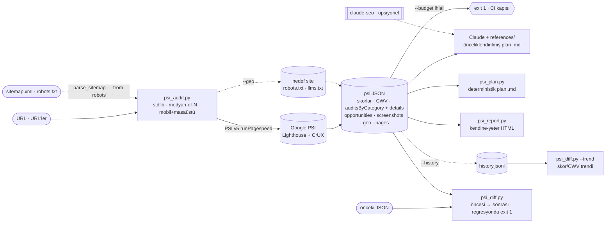

<p align="center">
  
</p>

<h1 align="center">pagespeed-plan</h1>

<p align="center">
  PageSpeed Insights denetimlerini önceliklendirilmiş, kanıtlı ve uygulanabilir bir
  iyileştirme planına çeviren, bağımlılıksız bir Claude skill'i.
</p>

<p align="center">
  
  
  
  
</p>

<p align="center"><b>Türkçe</b> · <a href="README.en.md">English</a></p>

PageSpeed Insights sana skoru ve önerileri verir. `pagespeed-plan` bunları CI'de kırılabilen bir
bütçe kapısına, dağıtım öncesi/sonrası bir diff'e, sitemap taramasına, paylaşılabilir bir rapora ve
bir ajanın okuyup uygulayabileceği önceliklendirilmiş bir plana çevirir — Node/Chrome ya da
`pip install` olmadan, saf Python ile.

## İçindekiler

- [Ne yapar](#ne-yapar)
- [Kurulum](#kurulum)
- [Kullanım](#kullanım)
- [Modlar ve betikler](#modlar-ve-betikler)
- [CI (GitHub Actions)](#ci-github-actions)
- [Nasıl çalışır](#nasıl-çalışır)
- [PSI ve diğer araçlara göre konum](#psi-ve-diğer-araçlara-göre-konum)
- [Örnek çıktı](#örnek-çıktı)
- [Yapılandırma](#yapılandırma)
- [Yerleşik derinlik](#yerleşik-derinlik)
- [SSS](#sss)
- [Roadmap](#roadmap)
- [Lisans ve atıf](#lisans-ve-atıf)

## Ne yapar

Bir URL'yi PageSpeed Insights v5 (Lighthouse) ile test eder ve görünen her denetimi — fırsatlar,
tanılar, Insights, teknolojiye özel öneriler, Core Web Vitals (lab + CrUX) — çıkarır. Her bulguya
düzeltme önerisini (`description`) ve somut kanıtını (`details`: hangi element, hangi değer → hedef)
ekler. Örneğin *"kontrast kötü"* demez; *"`button.cta` 2,1:1 → hedef 4,5:1"* der. Çıktı, etki × efor
sırasına dizilmiş tek bir Markdown planıdır.

Ölçüm yalnızca Python standart kütüphanesiyle yapılır; siteyi değiştirmez, yalnızca okur.

## Kurulum

```bash
git clone https://github.com/tasdeleno/pagespeed-plan.git ~/.claude/skills/pagespeed-plan
```

Hepsi bu — bağımlılık yok. (Opsiyonel: kota için `PSI_API_KEY` ortam değişkeni.)

## Kullanım

En kolayı: Claude'a **"şu sitenin PageSpeed testini yap"** de. Komut satırından:

```bash
python3 scripts/psi_audit.py https://ornek.com --out psi.json          # tek URL
python3 scripts/psi_audit.py --from-robots https://ornek.com           # robots.txt → tüm site
python3 scripts/psi_audit.py https://ornek.com --budget "perf=90"      # CI kapısı (exit 1)
python3 scripts/psi_plan.py psi.json --out plan.md                     # deterministik plan (LLM'siz)
python3 scripts/psi_report.py psi.json --out rapor.html                # HTML rapor
```

Tüm bayraklar ve `psi_diff`/`contrast` için [Modlar ve betikler](#modlar-ve-betikler).

## Modlar ve betikler

| Betik | İş |
|---|---|
| `scripts/psi_audit.py` | Denetim + JSON. Tek/çoklu URL, `--sitemap`, `--from-robots`, `--screenshots`, `--geo`, `--budget`, `--history` |
| `scripts/psi_plan.py` | JSON'dan LLM'siz, deterministik Markdown planı üretir (özet/CWV/öncelik/kanıt) |
| `scripts/psi_diff.py` | İki denetimi karşılaştırır (`--fail-on-regression`); `--trend history.jsonl` ile zaman trendi |
| `scripts/psi_report.py` | JSON'u kendine-yeter tek-dosya HTML rapora çevirir |
| `scripts/contrast.py` | Kod-tarafı WCAG kontrast oranı; AA geçmezse exit 1 (tarayıcı gerekmez) |

## CI (GitHub Actions)

`--budget` eşiği aşılırsa `psi_audit.py` **exit 1** döner ve yapıyı kırar:

```yaml
- name: PageSpeed bütçe kapısı
  run: |
    python3 scripts/psi_audit.py https://ornek.com \
      --strategy mobile --runs 1 --budget "perf=90,lcp=2500,cls=0.1"
```

Dağıtım sonrası regresyon kapısı için iki çalışmayı karşılaştır:
`python3 scripts/psi_diff.py eski.json yeni.json --fail-on-regression`.

## Nasıl çalışır

<p align="center"></p>

<details>
<summary>Metin tabanlı şema (Mermaid)</summary>



</details>

`psi_audit.py` ölçümü PSI'den, saha verisini CrUX'tan alır; `--geo`/`--sitemap`/`--from-robots` doğrudan
hedef siteden çeker. Aynı JSON'u `--budget` (CI kapısı), `psi_plan.py` (deterministik plan), `psi_report.py`
(HTML) ve `psi_diff.py` (iki çalışmayı karşılaştırma; `--history` ile zaman trendi) tüketir; zengin plan ise
Claude + yerleşik `references/` ile yazılır (`claude-seo` kuruluysa ek derinlik).

## PSI ve diğer araçlara göre konum

Sadece skoruna bakacaksan pagespeed.web.dev yeterli. Fark, PSI sayfasının yapmadığı işlerde:

| | pagespeed.web.dev | Lighthouse CI | Unlighthouse | pagespeed-plan |
|---|:---:|:---:|:---:|:---:|
| Önceliklendirilmiş plan | ham liste | — | — | ✓ |
| Somut kanıt (element/değer) | UI'da | — | kısmi | metin (ajan okur) |
| CI bütçe kapısı | — | ✓ | ✓ | ✓ |
| Öncesi/sonrası diff | — | ✓ | kısmi | ✓ |
| Çoklu sayfa / sitemap | — | ✓ | ✓ | ✓ |
| Tek-dosya HTML rapor | kendi UI | sunucu | ✓ | ✓ |
| GEO / llms.txt | — | — | — | ✓ |
| Kurulum yükü | — | Node | Node+Chrome | sıfır-pip |

## Örnek çıktı

`psi_report.py` ile üretilen kendine-yeter HTML rapor (skor kartları, CWV, öncelikler, kanıtlı bulgular):

<p align="center"></p>

Markdown planı; özet skorlar, Core Web Vitals, etki×efor öncelikleri, tüm performans bulguları,
SEO/erişilebilirlik aksiyonları (her biri somut kanıtla) ve dağıtım sonrası tekrar-test adımını içerir.
Kısa bir kesit:

```markdown
## 3. Öncelikli aksiyonlar (etki × efor)
| # | Aksiyon | Etki | Efor | Tahmini kazanç | Denetim |
|---|---|---|---|---|---|
| 1 | İşleme engelleyen kaynakları ertele | Yüksek | Yüksek | ~1100 ms | render-blocking-resources |

### Erişilebilirlik — 1 düzeltilecek
- **Kontrast düşük** (color-contrast) — Renkleri koyulaştır.
  - element: button.cta — <button class='cta'>Al</button> · contrast: 2.1
```

Aynı iskeleti `psi_plan.py` LLM olmadan üretir. Tam örnek:
[`references/ornek_plan_iskeleti.md`](references/ornek_plan_iskeleti.md).

## Yapılandırma

`psi_audit.py` bayrakları:

| Bayrak | Varsayılan | Açıklama |
|---|---|---|
| `--strategy` | `both` | `mobile` · `desktop` · `both` |
| `--runs` | 3 (çoklu: 1) | Strateji başına koşu; medyan alınır |
| `--sitemap URL` | — | sitemap.xml'i tara |
| `--from-robots URL` | — | robots.txt'ten sitemap keşfet |
| `--max-pages` | 10 | Çoklu modda sayfa üst sınırı |
| `--budget` | — | Eşik ihlalinde exit 1 (CI) |
| `--screenshots DIR` | — | Ekran görüntüsü + filmstrip yaz |
| `--geo` | — | robots.txt AI-crawler + llms.txt kontrolü |
| `--history FILE` | — | Koşuyu JSONL'e ekle (trend) |
| `--locale` | `tr` | Rapor dili |
| `--api-key` | `PSI_API_KEY` | PSI API anahtarı (kota için) |
| `--out FILE` | — | JSON'u dosyaya da yaz |

## Yerleşik derinlik

SEO/teknik/erişilebilirlik derinliği `references/` altında yereldir; `claude-seo` gerekmez
(kuruluysa opsiyonel ek derinlik için kullanılır).

| Dosya | İçerik |
|---|---|
| [`core-web-vitals-derin.md`](references/core-web-vitals-derin.md) | LCP alt-parçaları, INP/CLS kırılımı, eşikler, CrUX tuzakları |
| [`teknik-seo-derin.md`](references/teknik-seo-derin.md) | Crawlability, indexability, güvenlik, mobil, JS render, AI-crawler |
| [`seo-performans-ajan.md`](references/seo-performans-ajan.md) | Performans teşhis yöntemi ve darboğaz kataloğu |
| [`schema-ve-erisilebilirlik.md`](references/schema-ve-erisilebilirlik.md) | JSON-LD şablonları, WCAG/a11y eşlemesi |

## SSS

**API anahtarı gerekli mi?** Hayır — anahtarsız çalışır, ama Google düşük hız limiti uygular.
Medyan-of-3 birden çok istek attığı için `PSI_API_KEY` önerilir (ücretsiz: Google Cloud Console).

**Kota dolarsa (429)?** `--runs 1`'e düş, `PSI_API_KEY` ekle veya `--strategy mobile` ile istek sayısını yarıya indir.

**Neden PSI yerine bu?** PSI skoru ve önerileri verir; burada CI bütçe kapısı, diff, sitemap taraması,
paylaşılabilir rapor ve bir ajanın uygulayabileceği önceliklendirilmiş plan var. Bkz.
[konum tablosu](#psi-ve-diğer-araçlara-göre-konum).

**Siteyi değiştirir mi?** Hayır — yalnızca okur (PSI + robots.txt/llms.txt).

**Node/Chrome gerekir mi?** Hayır. Tüm betikler Python stdlib; `pip install` yok.

## Roadmap

Karbon/CO₂ tahmini · CrUX 25-hafta saha trendi · opsiyonel yerel Lighthouse (kota-bağımsız).

## Lisans ve atıf

MIT — [`LICENSE`](LICENSE). `references/` içeriği `claude-seo` v2.2.0 (AgriciDaniel, MIT)
materyalinden türetilmiştir; atıf: [`NOTICE.md`](NOTICE.md). Katkı için betiklerde stdlib-only
ilkesini koru ve `python3 scripts/test_psi_audit.py` öz-kontrolünü geçir.
